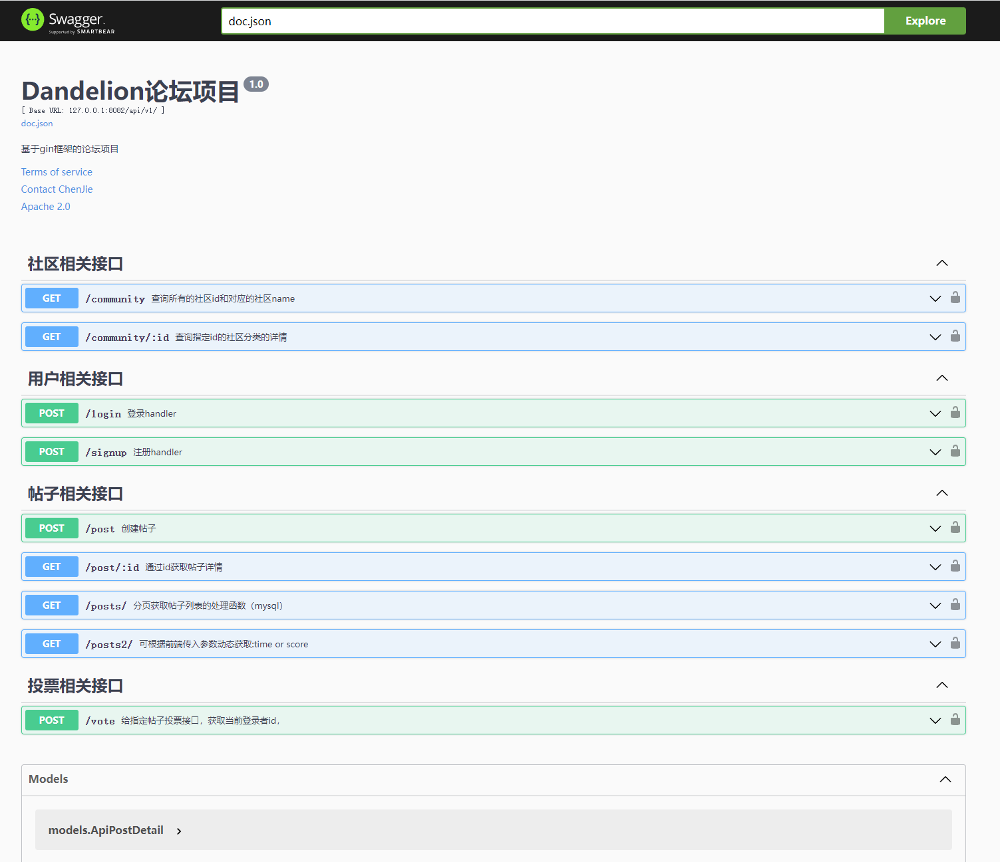
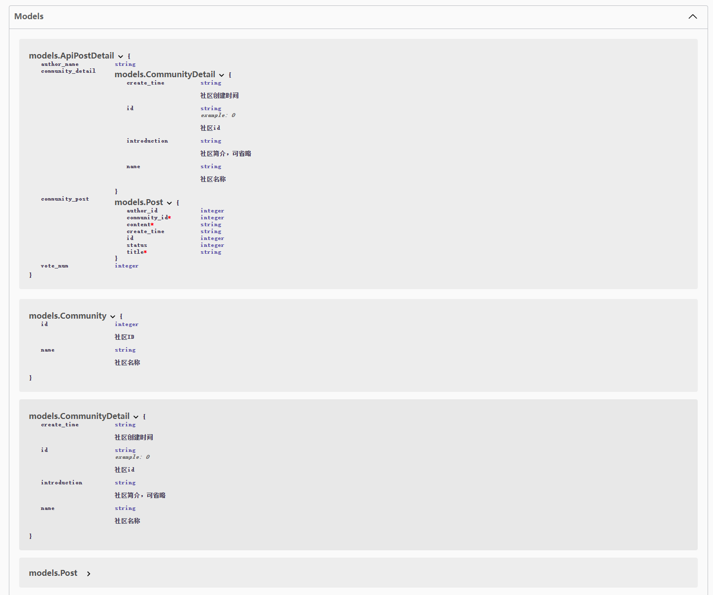
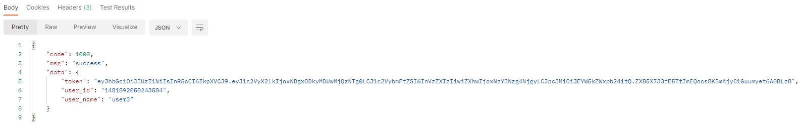
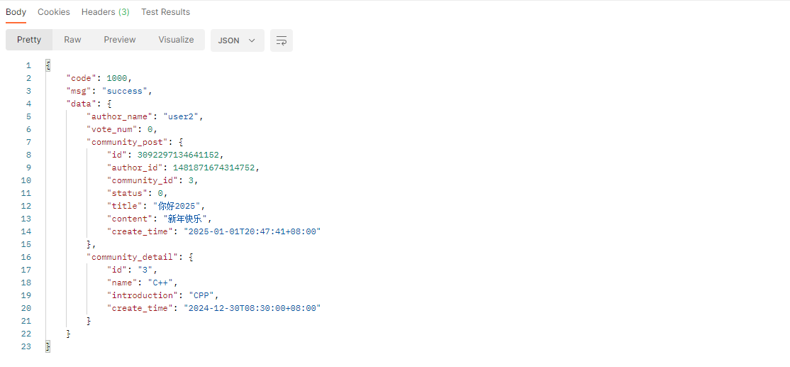
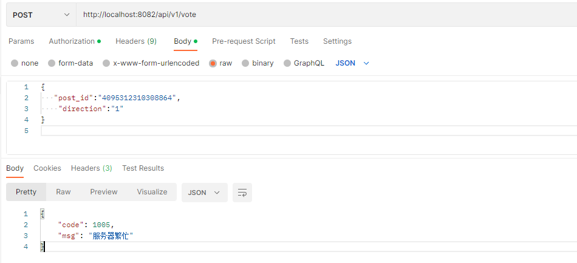
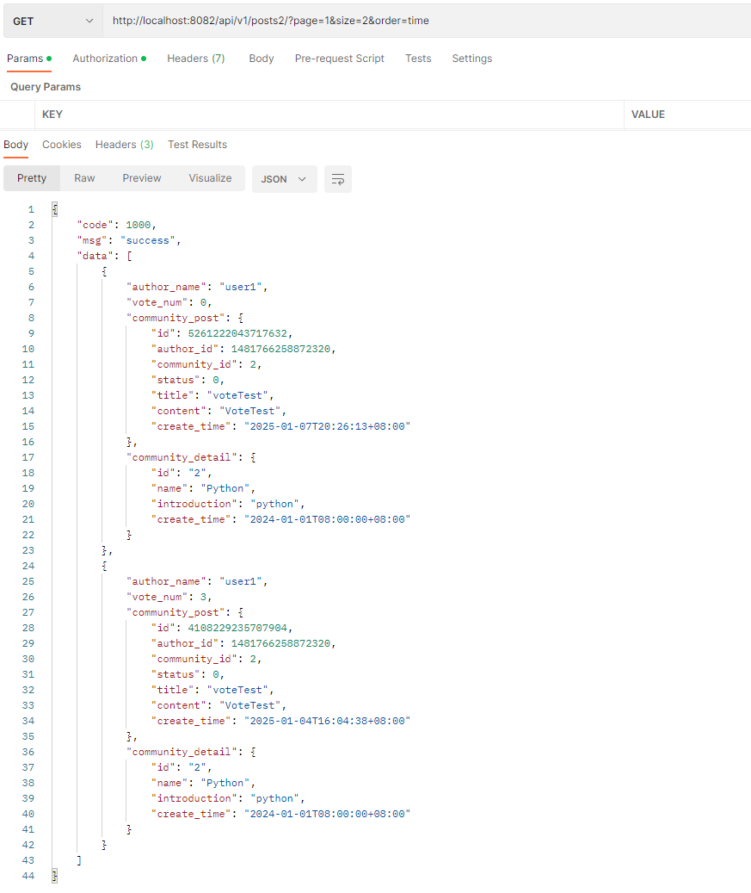

### 项目结构说明
- Controller：服务入口，处理请求参数、业务处理、返回响应
- Logic：也叫做Service层，负责处理业务逻辑
- Dao：负责数据相关处理，包含缓存与持久化存储
  + mysql：使用驱动"github.com/go-sql-driver/mysql" 连接mysql数据库，持久化存储数据
  + redis：使用驱动"github.com/go-redis/redis" 连接redis，缓存数据，比如帖子投票功能

- Logger：日志服务
  - 使用zap作为日志服务组件
  - 自定义ginLogger接收gin框架默认的日志，自定义GinRecovery来recover项目中可能出现的错误，并使用zap记录日志
  - 使用lumberjack切割日志文件，防止日志文件过大
  - 开发全流程均使用zap记录日志，便于快速定位bug
- Settings：配置服务，使用"github.com/spf13/viper"
  - 从文件中读取配置信息，将配置信息反序列化到结构体中
  - 监听配置文件，如果发生变化则重新反序列化，并且打印日志
- Pkg：包含两个工具jwt和snowflake
  - jwt：
    - 使用"github.com/dgrijalva/jwt-go" 生成token和解析token
    - 使用token的方式可以减少服务器的压力，无需为每个用户保存session
  - snowflake：使用"github.com/bwmarrin/snowflake" 随机生成用户ID
- Middleware：使用jwt开发认证中间件
- Models：存放基础数据的结构体，比如用户、社区和前端返回参数等model
- Routes：路由模块，包含所有服务地址和处理接口

- Docs：使用swag init生成swagger文档，见下方文件；补充注释，在路由中添加路径，生成swagger接口文档
  - docs.go
  - swagger.json
  - swagger.yaml
- .air.conf：使用"github.com/cosmtrek/air" 实现文件热重载，在监听到文件发生变化后，air可以自动编译并运行
- config.yaml：整个项目的配置文件，包含AppConfig、AuthConfig、LogConfig、MySQLConfig、RedisConfig
- Dandelion.log：项目开发和调试过程中的日志信息
- main.go：项目的主入口

### swagger生成的接口文档

### 项目功能演示
#### 1. 登录功能：登录成功之后会返回token

#### 2. 获取指定帖子功能，会返回帖子信息、作者信息、所属社区信息

#### 3. 投票功能，禁止重复投票

#### 4. 分页获取帖子信息，并且可以按照发布时间或者帖子分数排序

